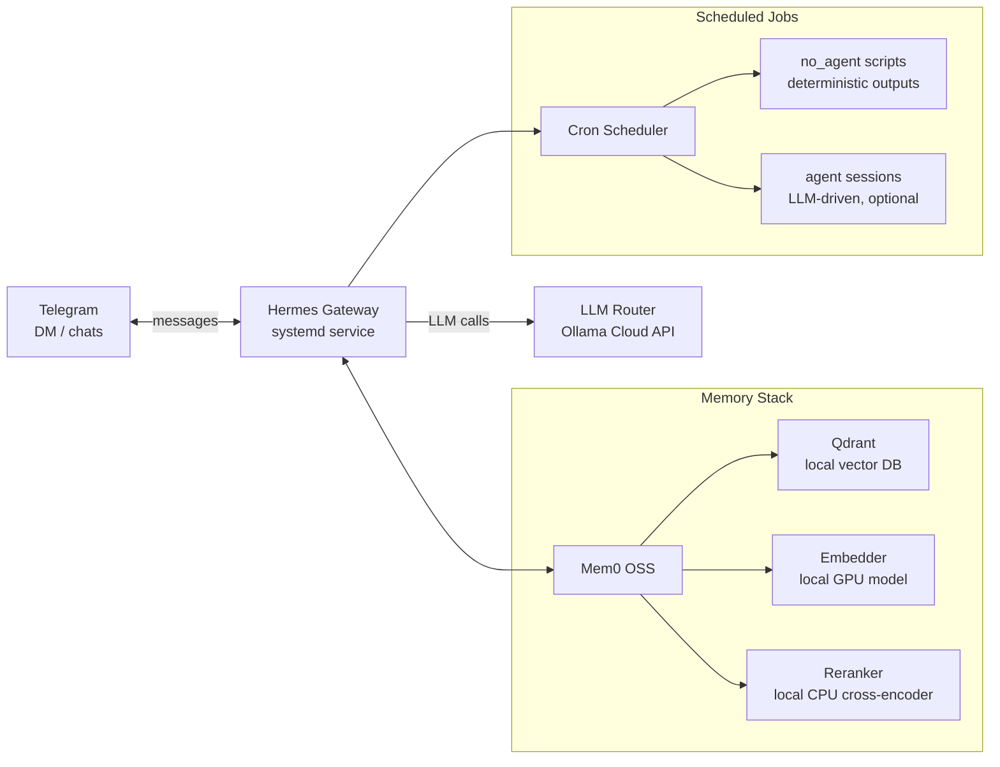

# Hermes Agent Playbook

Operational playbook and reference architecture for a self-hosted **Hermes Agent** deployment:
an LLM agent framework wired into messaging platforms, with persistent memory, scheduled
autonomous jobs, custom personas, and a skill system.

This repository documents a real working deployment (running 24/7 on WSL2) — the architecture
decisions, the failure modes we hit, and the operational patterns that survived contact with
production. Everything sensitive is redacted or replaced with `.example` templates.

## What This Is

Hermes Agent is an open-source AI agent framework. This playbook covers a deployment configured for:

- **Chat interface over Telegram** (DM + home-channel delivery, media in/out)
- **Cloud LLM routing** via Ollama Cloud's OpenAI-compatible endpoint
- **Persistent memory** — Mem0 OSS over local Qdrant, with hybrid retrieval (semantic + BM25),
  cross-encoder reranking, and temporal decay
- **Scheduled autonomous jobs** — cron-style recurring scripts with LLM-optional execution
- **Persona system** — character-driven agent identity (see [persona/](persona/))
- **Skill system** — procedural memory as loadable markdown modules

## Repository Layout

| Path | Contents |
|---|---|
| [docs/](docs/) | Architecture write-ups, operational runbooks, post-mortems |
| [examples/](examples/) | Sanitized config templates (`.example` files — copy and fill in) |
| [persona/](persona/) | Persona system guide + sample persona files |
| [samples/](samples/) | Sample memory data (synthetic — never ship real memory) |
| [scripts/](scripts/) | Operational scripts: health checks, memory consolidation, watchdogs |
| [skills-guide/](skills-guide/) | How to write and maintain agent skills |

## Reference Architecture

Key properties:

1. **Memory is a subsystem, not a feature** — embeddings, reranking, and LLM extraction each
   fail independently; the deployment health-checks all three legs
2. **Scheduled jobs run without the LLM when possible** (`no_agent` mode) — deterministic
   scripts with verifiable output, LLM reasoning only where content requires it
3. **Watchdog semantics** — health checks alert only on failure ("silence = healthy"),
   because a chatty monitor trains you to ignore it
4. **Secrets never live in config files that get committed** — `.env` + `.example` pattern
   throughout

## Quick Start

1. Set up Hermes Agent itself (see upstream docs)
2. Copy each file in [examples/](examples/) to its real location and fill in secrets
3. Install the systemd units in [docs/systemd.md](docs/systemd.md)
4. Deploy [scripts/](scripts/) and wire the startup check into the gateway service
5. Add your first scheduled job per [docs/cron-jobs.md](docs/cron-jobs.md)

## Conventions

- **`.example` files** — every config with secrets ships as `name.example`; the real file is
  gitignored
- **Redaction discipline** — API keys, bot tokens, chat IDs are `[REDACTED]` in all docs
- **Synthetic samples only** — memory/persona samples in [samples/](samples/) are fabricated
  data, never real conversation history

## License

MIT for original content in this repository. Persona files are fan works derived from
Steins;Gate (MAGES./5pb.) — non-commercial, character-owned-by-original-creators; they are
included as *examples of the persona file format*, not as licensed content.